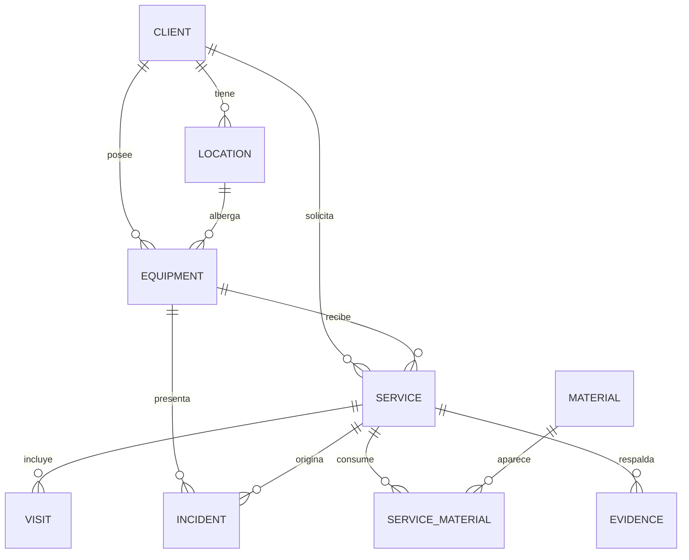

# Modelo de datos

Documentación conceptual del esquema de FieldDesk. La implementación concreta
con SQLAlchemy y Alembic corresponde a la Fase 2; este documento es la
referencia que guía su desarrollo.

## 1. Diagrama entidad-relación

## 2. Entidades y campos

### Client

| Campo | Tipo | Restricciones |
| ----- | ---- | ------------- |
| id | Integer | PK |
| name | String | obligatorio, indexado |
| company | String | opcional |
| phone | String | opcional |
| email | String | opcional |
| address | String | opcional |
| notes | Text | opcional |
| created_at | DateTime | obligatorio |
| updated_at | DateTime | obligatorio |

### Location

| Campo | Tipo | Restricciones |
| ----- | ---- | ------------- |
| id | Integer | PK |
| client_id | Integer | FK → Client, obligatorio |
| name | String | obligatorio |
| address | String | opcional |
| reference | String | opcional |
| notes | Text | opcional |
| created_at / updated_at | DateTime | obligatorio |

### Equipment

| Campo | Tipo | Restricciones |
| ----- | ---- | ------------- |
| id | Integer | PK |
| location_id | Integer | FK → Location, obligatorio |
| name | String | obligatorio |
| type | String | obligatorio |
| brand | String | opcional |
| model | String | opcional |
| serial_number | String | opcional, indexado |
| installation_date | Date | opcional |
| warranty_expiration | Date | opcional |
| status | Enum | `OPERATIONAL`, `MAINTENANCE`, `OUT_OF_SERVICE`, `RETIRED` |
| notes | Text | opcional |
| created_at / updated_at | DateTime | obligatorio |

### Service

| Campo | Tipo | Restricciones |
| ----- | ---- | ------------- |
| id | Integer | PK |
| client_id | Integer | FK → Client, obligatorio |
| equipment_id | Integer | FK → Equipment, obligatorio |
| service_type | String | obligatorio |
| description | Text | opcional |
| scheduled_date | DateTime | opcional |
| status | Enum | `PENDING`, `IN_PROGRESS`, `COMPLETED`, `CANCELLED` |
| priority | Enum | `LOW`, `MEDIUM`, `HIGH` |
| created_at / updated_at | DateTime | obligatorio |

### Visit

| Campo | Tipo | Restricciones |
| ----- | ---- | ------------- |
| id | Integer | PK |
| service_id | Integer | FK → Service, obligatorio |
| visit_date | Date | obligatorio |
| start_time | Time | opcional |
| end_time | Time | opcional |
| work_performed | Text | opcional |
| observations | Text | opcional |
| created_at / updated_at | DateTime | obligatorio |

### Incident

| Campo | Tipo | Restricciones |
| ----- | ---- | ------------- |
| id | Integer | PK |
| equipment_id | Integer | FK → Equipment, obligatorio |
| service_id | Integer | FK → Service, opcional |
| title | String | obligatorio |
| description | Text | opcional |
| priority | Enum | `LOW`, `MEDIUM`, `HIGH` |
| status | Enum | `OPEN`, `IN_PROGRESS`, `RESOLVED`, `CANCELLED` |
| resolution | Text | opcional (al resolver) |
| created_at / updated_at | DateTime | obligatorio |

### Material

| Campo | Tipo | Restricciones |
| ----- | ---- | ------------- |
| id | Integer | PK |
| name | String | obligatorio |
| description | Text | opcional |
| unit | String | opcional |
| created_at / updated_at | DateTime | obligatorio |

### ServiceMaterial (tabla de asociación)

| Campo | Tipo | Restricciones |
| ----- | ---- | ------------- |
| service_id | Integer | FK → Service, PK compuesta |
| material_id | Integer | FK → Material, PK compuesta |
| quantity | Numeric | obligatorio, > 0 |
| notes | Text | opcional |

### Evidence

| Campo | Tipo | Restricciones |
| ----- | ---- | ------------- |
| id | Integer | PK |
| service_id | Integer | FK → Service, obligatorio |
| filename | String | obligatorio |
| filepath | String | obligatorio (ruta relativa a `storage/`) |
| description | Text | opcional |
| created_at | DateTime | obligatorio |

## 3. Reglas de integridad

- Todas las claves foráneas se declaran explícitamente y se aplican con
  `PRAGMA foreign_keys = ON` en cada conexión SQLite.
- Un `Location` pertenece a un único `Client`.
- Un `Equipment` pertenece a un único `Location`; el acceso desde `Client`
  a sus equipos es transitivo a través de `Location` (relación de solo
  lectura `Client.equipment`).
- Un `Service` referencia siempre a un `Client` y a un `Equipment`.
- Una `Evidence` referencia siempre a un `Service`.
- `ServiceMaterial.quantity` debe ser mayor que cero
  (`CheckConstraint`).

### Política de borrado

La política combina restricciones a nivel de base de datos y validación en la
capa de servicios (ver [ADR-009](../architecture/decisions.md)):

| Relación | `ON DELETE` | Resultado |
| -------- | ----------- | --------- |
| Client → Location | `RESTRICT` | No se puede borrar un cliente con ubicaciones. |
| Client → Service | `RESTRICT` | No se puede borrar un cliente con servicios. |
| Location → Equipment | `RESTRICT` | No se puede borrar una ubicación con equipos. |
| Equipment → Service | `RESTRICT` | No se puede borrar un equipo con servicios. |
| Equipment → Incident | `RESTRICT` | No se puede borrar un equipo con incidencias. |
| Material → ServiceMaterial | `RESTRICT` | No se puede borrar un material en uso. |
| Service → Visit | `CASCADE` | Las visitas se eliminan con su servicio. |
| Service → Evidence | `CASCADE` | Las evidencias se eliminan con su servicio. |
| Service → ServiceMaterial | `CASCADE` | Los consumos se eliminan con su servicio. |
| Service → Incident | `SET NULL` | La incidencia se conserva ligada al equipo. |

La capa de servicios comprobará además las relaciones antes de eliminar y
ofrecerá mensajes comprensibles al usuario.

## 4. Índices previstos

| Tabla | Índice | Motivo |
| ----- | ------ | ------ |
| client | `name` | búsqueda por nombre |
| equipment | `serial_number` | localización por número de serie |
| service | `client_id`, `equipment_id`, `status` | filtros y dashboard |
| incident | `equipment_id`, `status` | historial y alertas |
| visit | `service_id` | historial por servicio |
| evidence | `service_id` | evidencias de un servicio |

## 5. Convenciones

- Nombres de tabla en singular y en minúsculas (`client`, `service`...).
- Clave primaria entera autoincremental `id` salvo en `service_material`, que
  usa una clave primaria compuesta (`service_id`, `material_id`).
- `created_at` se asigna al crear y `updated_at` se actualiza en cada cambio.
  Ambos se almacenan como **fecha/hora UTC sin zona** porque SQLite no
  conserva la información de zona horaria (ver ADR-010).
- Los enums (`StrEnum`) se almacenan como cadenas con una restricción `CHECK`,
  lo que facilita la lectura de la base de datos y la exportación a CSV.
- `Evidence.filepath` es una ruta **relativa** al directorio
  `settings.storage_dir`, de modo que el backup sea portable entre equipos.
- La tabla `service_material` no tiene `created_at`/`updated_at` para
  mantenerse fiel a los campos mínimos del enunciado.
